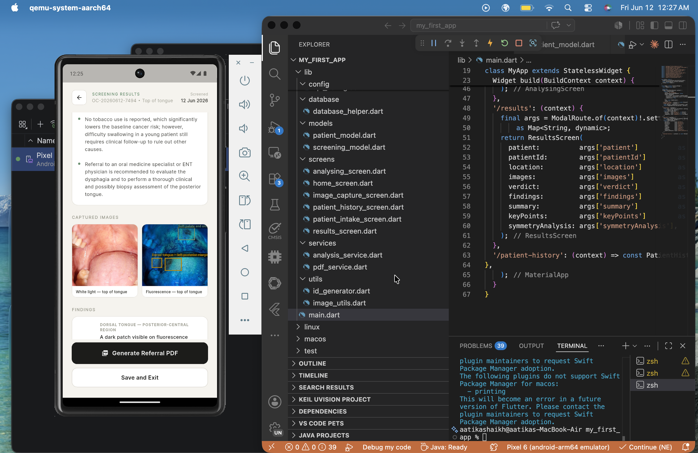

# OC Screening App — Full Project Report

---


## What This Project Actually Is

A smartphone-based oral cancer early detection system designed for deployment in Karachi's industrial communities; dockyards, transport hubs, roadside markets, where oral cancer rates are among the highest in the world and access to specialist care is effectively zero.

The system has two components that work together: a Flutter Android application and a low-cost hardware attachment for fluorescence imaging. Together they form a triage tool that allows non-specialist users, either trained Community Health Workers or concerned individuals, to capture images of oral tissue, receive an AI-powered risk assessment, and act on it before a lesion becomes advanced.

The clinical foundation is autofluorescence. Healthy oral mucosa absorbs 405nm blue-violet light and re-emits it as a pale green glow. Dysplastic or cancerous tissue loses this autofluorescence capacity and appears dark against the green background, a phenomenon called Fluorescence Visualisation Loss (FVL). This is the same principle used in professional devices like the VELscope, which costs thousands of dollars. Our prototype replicates the core imaging principle for under $50.

---

## Why This Problem Matters

Pakistan has one of the highest rates of oral cancer in the world. In Karachi's industrial areas, the majority of male workers use smokeless tobacco daily; Gutka, Paan, Naswar. These substances are held in the gingivobuccal sulcus for extended periods, delivering carcinogens directly to the mucosal lining. The anatomical sites most affected, lateral borders of the tongue, floor of mouth, buccal mucosa, are the exact sites our app targets.

The gap in survival rates tells the real story: catch oral cancer early and over 80% of patients survive. Catch it late and that number falls below 30%. But this isn't a failure of treatment — it's a failure of reach. The people most at risk simply don't show up in oncology clinics. They only seek formal care once symptoms become impossible to ignore, and by then, it's often too late.

This tool attacks this gap directly.

---

## The Software Architecture

### Technology Stack

- **Frontend:** Flutter (Android-first, iOS-capable)
- **Database:** SQLite via `sqflite` — local, on-device, no internet required for storage
- **AI:** Anthropic Claude API (claude-sonnet) — vision-capable, called per screening
- **PDF:** `pdf` and `printing` packages — generates referral documents on-device
- **Preferences:** `shared_preferences` — stores CHW identity locally

### File Structure and What Each File Does

```
lib/
├── config/
│   ├── api_config.dart              # Stores Anthropic API key and model config
│   └── api_config_template.dart     # Template for safe version control (no key)
│
├── database/
│   └── database_helper.dart         # SQLite setup, all read/write functions,
│                                    # patient and screening save/query logic
│
├── models/
│   ├── clinic_model.dart            # Defines what a clinic record looks like
│   │                                # (name, area, address, phone, type)
│   ├── patient_model.dart           # Patient data structure: age, gender, phone,
│   │                                # tobacco use, duration, frequency, symptoms,
│   │                                # visit type, auto-generated ID
│   └── screening_model.dart         # Screening record: patient ID, location,
│                                    # images with labels, verdict, findings,
│                                    # symmetry analysis, bounding boxes
│
├── screens/
│   ├── communityhealthworker/
│   │   ├── analysing_screen.dart    # Loading screen while API processes images
│   │   ├── chw_setup_screen.dart    # One-time name/ID setup for the CHW
│   │   ├── home_screen.dart         # CHW dashboard: CHW name, start screening,
│   │   │                            # patient history, screening info, today's count
│   │   ├── image_capture_screen.dart# Location selection (6 sites) + dynamic
│   │   │                            # image capture flow (2 or 4 images depending
│   │   │                            # on site), blue light transition screen,
│   │   │                            # review screen with thumbnails
│   │   ├── patient_history_screen.dart # Searchable list of all past screenings,
│   │   │                            # colored dot per risk level, tap to view history
│   │   ├── patient_intake_screen.dart  # 4-page conversational intake: identity,
│   │   │                            # tobacco use with skip logic, symptoms,
│   │   │                            # visit type — all large tap buttons
│   │   ├── results_screen.dart      # Color-coded verdict card, AI summary, key
│   │   │                            # points, findings with bounding box overlays,
│   │   │                            # symmetry analysis (side of tongue only),
│   │   │                            # image thumbnails, PDF generation, save & exit
│   │   └── screening_info_screen.dart  # Reference screen for CHWs explaining
│   │                                # how the tool works and what colors mean
│   │
│   └── self_assessment/
│       ├── analysing_screen.dart    # Simpler loading screen for self-assessment
│       ├── capture_screen.dart      # 3-image white-light guided self-capture
│       │                            # with mirror-friendly plain instructions
│       ├── next_steps_screen.dart   # Area selection, filtered clinic list,
│       │                            # tobacco cessation info, shareable summary
│       ├── results_screen.dart      # Plain-language verdict, image thumbnails,
│       │                            # single "What should I do next?" button
│       ├── risk_questions_screen.dart  # Scrollable intake: age, tobacco yes/no
│       │                            # with type, symptoms as toggleable chips
│       └── welcome_screen.dart      # Warm intro explaining the 2-minute process
│
├── services/
│   ├── analysis_service.dart        # CHW analysis: sends patient profile +
│   │                                # all images to Claude, receives structured
│   │                                # JSON with verdict, findings, key points,
│   │                                # symmetry analysis, bounding boxes
│   ├── pdf_service.dart             # Generates referral PDF: header, verdict
│   │                                # banner, patient table (including tobacco
│   │                                # and symptoms), AI result, findings,
│   │                                # symmetry analysis, image grid, footer
│   └── self_assessment_analysis_service.dart  # Separate simpler analysis for
│                                    # self-assessment: no fluorescence references,
│                                    # plain language output, no bounding boxes
│
├── utils/
│   ├── chw_preferences.dart         # Saves and reads CHW name using
│   │                                # shared_preferences
│   ├── clinic_data.dart             # Hardcoded list of real Karachi clinics
│   │                                # mapped by area with getClinicsByArea()
│   ├── id_generator.dart            # Generates anonymized patient IDs in format
│   │                                # OC-YYYYMMDD-XXXX
│   └── image_utils.dart             # Image handling utilities
│
├── widgets/
│   └── oral_diagram.dart            # Reusable mouth diagram widget
│
└── main.dart                        # Entry point: checks for CHW identifier,
                                     # routes to mode_selection_screen
```

---

## The Two Modes Explained

### Community Health Worker Mode

This mode is for trained field workers screening other people. The full flow is:

**App launch** → checks `chw_preferences.dart` for saved CHW name → if first launch, shows `chw_setup_screen.dart` to capture CHW identity → routes to `mode_selection_screen.dart`

**Mode selection** → CHW taps Community Health Worker → routes to `home_screen.dart`

**Home screen** → displays CHW name, today's screening count, three options: Start Screening, Patient History, Screening Info

**Start screening** → `patient_intake_screen.dart`:
- Page 1: Age, gender, phone number (optional)
- Page 2: Tobacco use yes/no, type if yes (Gutka, Paan, Naswar, Cigarettes, Multiple)
- Page 3: Duration and frequency (skipped if no tobacco)
- Page 4: Symptoms and visit type (new/returning)
- Patient ID auto-generated in format OC-YYYYMMDD-XXXX

**Image capture** → `image_capture_screen.dart`:
- Location selection from 6 sites: Top of tongue, Underside of tongue, Side of tongue, Floor of mouth, Roof of mouth, Cheek
- Side of tongue and Cheek: 4 images (white light left + right, fluorescence left + right)
- All other sites: 2 images (white light + fluorescence)
- Transition screen between white and fluorescence capture reminding CHW to switch on the blue light
- Review screen with thumbnails before submitting

**Analysis** → `analysing_screen.dart` calls `analysis_service.dart`:
- Encodes all images to base64
- Builds patient profile string including age, gender, tobacco details, symptoms, visit type
- Sends all content blocks to Claude with a detailed clinical system prompt covering FVL interpretation, tobacco-specific risk stratification, anatomical site-specific analysis, and symmetry logic
- Receives structured JSON: verdict, summary, key points, per-image findings with bounding boxes, symmetry analysis (Side of tongue only)

**Results** → `results_screen.dart`:
- Color-coded verdict card (green/amber/red) with plain-language description and referral urgency
- AI summary paragraph
- Key points list
- Per-image findings with bounding box overlays drawn directly on thumbnail images
- Symmetry analysis card (only visible for Side of tongue screenings)
- Generate Referral PDF button → calls `pdf_service.dart` → opens share sheet
- Save and Exit → saves patient and screening record to SQLite → returns to home

**Patient history** → `patient_history_screen.dart`:
- Searchable by patient ID
- Each record shows ID, date, colored dot for last verdict
- Tap to view full results of any past screening

### Self-Assessment Mode

This mode is for individuals checking themselves privately. No CHW required, no clinical language, no fluorescence hardware.

**Mode selection** → Self Assessment → `welcome_screen.dart` (warm intro, 2-minute promise)

**Risk questions** → `risk_questions_screen.dart`:
- Single scrollable screen
- Age (numeric), tobacco yes/no with type, symptoms as toggleable chips
- Data held in memory only, never saved to database

**Image capture** → `capture_screen.dart`:
- 3 white-light images only: Full Mouth, Tongue, Cheek
- Mirror-friendly plain instructions
- No location selection, no fluorescence, no blue light

**Analysis** → `analysing_screen.dart` calls `self_assessment_analysis_service.dart`:
- Separate, simpler service with its own plain-language system prompt
- No fluorescence references, no symmetry analysis, no bounding boxes
- Returns: verdict, plain-language summary addressed directly to the user, key points, one-sentence recommendation

**Results** → `self_assessment/results_screen.dart`:
- Color-coded verdict with plain-language description
- Summary and image thumbnails
- Single button: "What should I do next?"

**Next steps** → `next_steps_screen.dart`:
- Area dropdown for Karachi neighborhoods
- Filtered clinic list from `clinic_data.dart`
- Tobacco cessation information if tobacco was flagged
- Shareable plain-text summary

---

## The AI System — How It Actually Works

### CHW Analysis Prompt Design

The system prompt sent to Claude for CHW mode is one of the most technically thoughtful parts of the project. It is not a generic "look at this mouth" instruction. It is a structured clinical brief that encodes real oral oncology knowledge:

**Fluorescence interpretation rules:** The prompt teaches Claude what FVL looks like: dark, brown, or black patches against green, and critically, what to discount as artefact: shadows from folds, pooled saliva, dental restorations. This specificity is what separates a useful result from noise.

**Tobacco-specific risk stratification:** The prompt maps tobacco type to anatomical risk site. Gutka held in the gingivobuccal sulcus elevates risk at the buccal mucosa and floor of mouth. Naswar in the lower lip increases lower gingiva risk. This means a suspicious finding in a long-term Gutka user at the floor of mouth is flagged differently from the same finding in a non-tobacco user. The AI doesn't just look at the image — it integrates the patient profile.

**Symmetry analysis logic:** Bilateral fluorescence asymmetry is a genuine clinical warning sign. The prompt instructs Claude to compare left and right when Side of tongue is selected and explicitly set symmetryAnalysis to null for all other locations. This prevents spurious symmetry output.

**Structured JSON output:** Claude is instructed to return only a valid JSON object with no preamble. The structure includes verdict, summary, findings array (each with area, finding text, flagged boolean, image label, and normalised bounding box coordinates), key points array, and symmetry analysis object. The app parses this directly.

**Bounding boxes:** Claude returns normalised coordinates (x, y, w, h as decimal fractions 0.0 to 1.0) for locatable findings. The results screen uses a custom `_BBoxPainter` widget to draw these as annotated overlays directly on the thumbnail images. This is the closest thing to what a clinical annotation tool would produce.

### Self-Assessment Prompt Design

The self-assessment prompt is intentionally stripped down. No fluorescence terminology. No clinical site-specific risk mapping. It instructs Claude to look for visible abnormalities in white-light images — unusual patches, sores, discolouration — weight tobacco use and symptoms in its assessment, and return a plain-language verdict addressed directly to the person being screened. The output has no findings list and no bounding boxes — just verdict, summary, key points, and a one-sentence recommendation.

---

## The Hardware — How It Works

### Components

| Item | Purpose | Approximate Cost |
|---|---|---|
| 405nm LED flashlight | Excitation light source for autofluorescence | PKR1000-2000 |
| Lee Filter #15 / Rosco #19 gel sheet | Longpass filter — blocks reflected blue light, passes green fluorescence | PKR 1000 |
| Disposable intraoral dental mirrors | Reflects hard-to-see areas inside the mouth | PKR1500 for pack |
| Phone clamp with arm | Holds phone steady at consistent distance | PKR1000 |
| Black craft foam | Light-blocking hood around camera to prevent ambient wash-out | $=PKR200-500 |
| Portable power bank | Keeps phone charged during field sessions | Already owned |
| Tongue depressors | Tissue retraction | PKR500 |
| Nitrile gloves | Infection control | PKR500 |

**Total: Under $50**

### Physical Assembly

The phone clamp holds the phone on an arm, camera pointing toward the patient's mouth. Black foam is cut into a sleeve that wraps around the camera end, creating a light-sealed tunnel. For white-light images the sleeve is the only modification; phone flash on, no filter. For fluorescence images, a small square of orange gel is placed over the camera lens inside the foam sleeve, the 405nm LED is switched on, and room lights are dimmed if possible.

The intraoral mirror is held inside the patient's mouth by the CHW and angled to reflect the target anatomical site back toward the phone camera. The tongue depressor is used in the other hand to retract tissue and clear the view.

### The Optical Logic

The 405nm light excites oral mucosa. Healthy tissue re-emits green autofluorescence. The orange longpass filter cuts off wavelengths below ~530nm; meaning the reflected 405nm blue is blocked and only the green fluorescence passes through to the camera sensor. The result is an image where healthy tissue glows green and abnormal tissue appears dark. This is the same optical principle used in devices costing 100 times more.

### Current Limitations

This is a validation prototype. Mirror angle will vary between patients. Ambient light leakage through the foam hood is possible. Saliva on the mirror degrades image quality. These are real limitations that the polished clip-on device, with fixed geometry, integrated LEDs, and disposable optical tips, would address. For now the rig is enough to answer the core question: can a smartphone camera capture meaningful fluorescence differences between normal and abnormal oral tissue?

### Real-World Grounding

The project is not solving a hypothetical problem. Oral cancer is the fourth most common cancer in Pakistan. The population targeted, informal industrial workers in Lyari and Landhi, is genuinely underserved. The barriers to care, cost, distance, stigma, healthcare distrust, are real and documented.

The CHW deployment model is modeled on how community health interventions actually work in Pakistan and similar contexts. The self-assessment mode exists because some people will never engage with a health worker but will quietly check themselves if given a non-judgmental tool on their own phone.

The referral PDF is not a demo feature. It is the mechanism by which a positive screening result actually converts into a clinical encounter - a CHW hands a formatted document to a patient who takes it to a clinic. That chain of action is thought through.

### Prototype Integrity

The project is honest about what it is. Every screen carries "Prototype — Not for Clinical Use." The AI is a vision model, not a validated diagnostic algorithm. 

### The Progression Path

- Phase 1 (current): Software prototype with Claude API, hardware validation rig under $50
- Phase 2: Clinical pilot with CHWs in Karachi industrial areas, image dataset collection
- Phase 3: Fine-tuned model trained on validated fluorescence images from this population, replacing the API with an on-device model for offline deployment
- Phase 4: Polished clip-on hardware with fixed geometry, integrated LEDs, disposable optical tips — engineered for mass production at low cost

Each phase builds on the last. The software architecture already anticipates this; the analysis service is modular, the prompt engineering is documented, the database schema supports longitudinal tracking for research use.

---

## What I've Actually Built

- Designed and built a complete Flutter application with two fully separate user modes
- Created a patient data model, screening data model, and SQLite database with proper migrations
- Built a dynamic image capture flow that adapts to anatomical location (2 or 4 images)
- Integrated the Anthropic Claude API with a clinical-grade system prompt
- Implemented bounding box annotation overlays on result images
- Generated professional referral PDFs on-device with patient data, AI findings, and images
- Built a self-assessment mode with its own intake, capture, analysis service, and clinic lookup
- Started Designing a hardware prototype for under PKR7000 that replicates the optical principle of a million rupee clinical device

This is not a toy project. It is a coherent system built on real clinical reasoning, deployed for a real population, with a clear path from prototype to impact.

---

*Prototype — Not for Clinical Use*
